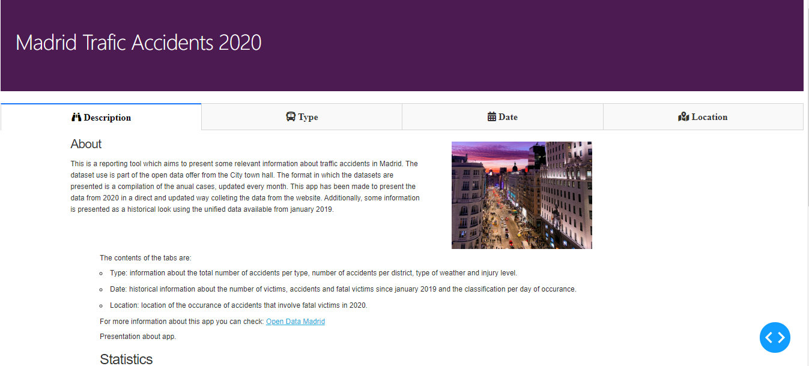
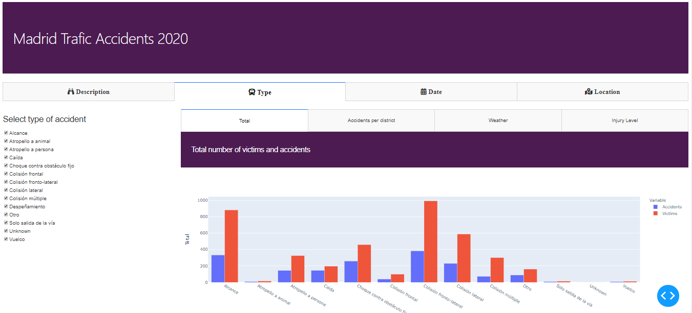
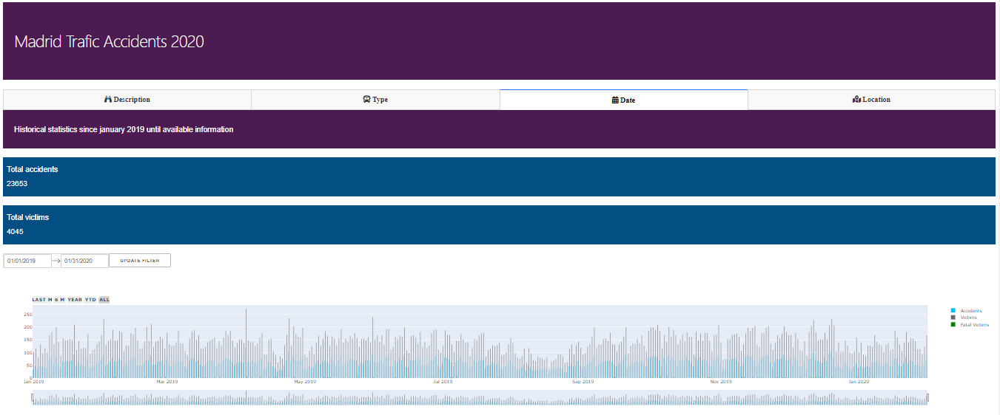

```{r setup, include=FALSE}
knitr::opts_chunk$set(echo = FALSE)
```

```{css}
#left {
	margin: 15px 0 20px 20px;
	text-align: left;
	float: left;
	z-index:-10;
	width:48%;
	font-size: 0.85em;
	line-height: 1.5; 
}

#right {
	margin: 15px 0 20px 0;
	float: right;
	text-align: left;
	z-index:-10;
	width:48%;
	font-size: 0.85em;
	line-height: 1.5; 
}
```

## {}
<h1 style="background-color:DarkMagenta;">About</h1>
<section>
<p class="fragment fade-in-then-semi-out"">The present document has all the information with respect to the app created to analize the data of traffic accidents in Madrid</p> 
<p class="fragment fade-in-then-semi-out">The dataset use is part of the open data from Madrid and contains information about the accidents that happend in each year, updating the cases monthly</p>
</section>

## {}
<h1 style="background-color:DarkMagenta;">Dataset</h1>
<span style="display: inline-block;" class="fragment fade-left" data-fragment-index="1"> The dataset contains registers of people impicated in traffic accidents as the observations, the information given is: </span>
</br>
<span style="display: inline-block;" class="fragment fade-left" data-fragment-index="2">Number of expedient which is an id of the accident, </span>
<span style="display: inline-block;" class="fragment fade-left" data-fragment-index="3">Timing variables: Date, weather and hour of the accident </span>
<span style="display: inline-block;" class="fragment fade-left" data-fragment-index="4">Location variables: street, number and district where it happend </span>
<span style="display: inline-block;" class="fragment fade-left" data-fragment-index="5">About the accident: type of vehicle and type of accident</span>
<span style="display: inline-block;" class="fragment fade-left" data-fragment-index="6">About the victims: type of victim, age range, sex and injury level</span>
<p class="fragment roll-in">For more information about the dataset and other datasets go to: < [Madrid Open Data](https://datos.madrid.es/)></p>

## {}
<h1 style="background-color:DarkMagenta;">Preprocess</h1>
<p class="fragment fade-in-then-semi-out""> The labels used in the dataset are records in Spanish, since they could change in time they have been treated in its original idiom.</p>
<p class="fragment fade-in-then-semi-out""> Additionally, there are some control preprocess done in order to keep the update function of the app, like identifying from the dataset obtained from the web all the categories and variables, and create new categories for treating the data and make the calculations.</p>


## {data-background=#000000}
<h1 style="background-color:DarkMagenta;">Tabs</h1>
 
## {}
<h1 style="background-color:DarkMagenta;">Description</h1>

<p> In the first tab you can find some breve description about the app, the date of the last record found on the Website and the count of accidents, victims and fatal victims until that day.</p>

## {}
<h1 style="background-color:DarkMagenta;">Type</h1>

<div id="right">

</div>

<div id="left">
<p> In the type tab you can select the type/types of accidents for which you want to review the information about.You will also find that the information display of all the subtabs will change with your selection. The first one will present the total number of victims and accidents for each type selected and if you pass the cursor over the graph a table with the counts will appear at the bottom</p>
</div>

## {}
<h1 style="background-color:DarkMagenta;">Type</h1>
<p>Additionally, you have infomation about: </p>
- Number of accidents per district
- Number of victims classified by district
- The percentage of accidents and victims based on the weather of the day.
- Number of victims depending of their injury level, these categories have been developed based on [this information](https://datos.madrid.es/FWProjects/egob/Catalogo/Seguridad/Ficheros/Estructura_DS_Accidentes_trafico_desde_2019.pdf), you can pass the cursor and there is a table which will display the number of victims of that injury level and the age range division.

## {}
<h1 style="background-color:DarkMagenta;">Date</h1>
<div id="right">

</div>

<div id="left">
<p> This tab contains historical infomation about  registers since january 2019, the app will return automatically the hole dataset for 2019 and 2020 which is expected to be update by the website every month. </p>
</div>

## {}
<h1 style="background-color:DarkMagenta;">Date</h1>
<p>
The first graph allows to see the series interactively by month, the last 6 months, 1 year from the last date, one year calendar, and all the records by selecting the buttons above it.There is a filter update that will change the graph by selecting the range of dates.In the second graph, you can also check the total number of accidents, victims and percentage of accidents based on the day on the week that they occured and the injury level. </p>

## {}
<h1 style="background-color:DarkMagenta;">Location</h1>
<div id="right">

</div>

<div id="left">
<p>This tab displays a map that has been built by performing a geolocation function to get the location of the accidents that involved fatal victims. The points display correspond to the records of the victims that were succesfully located. You can display more information about those and the ones that could not be identified by the direcction given in the dataset by clicking the buttons placed above. 

## {data-background=#000000}
<h1 style="background-color:DarkMagenta;">Packages used and references</h1>
<div id="right">

## {}
<h1 style="background-color:DarkMagenta;">Modules</h1>

<p>  The modules use are the following: <p>

- dash
- dash_core_components
- dash_html_components
- dash.dependencies
- dash_bootstrap_components
- datetime
- dateutil.parser
- pandas
- requests
- numpy
- plotly.express
- plotly.graph_objects
- dash_table


## {}
<h1 style="background-color:DarkMagenta;">References</h1>

<p>  References checked in order to create the app: <p>

- [Dash Plotly user guide](https://dash.plotly.com/)

- [Dash Gallery](https://dash-gallery.plotly.host/Portal/)

